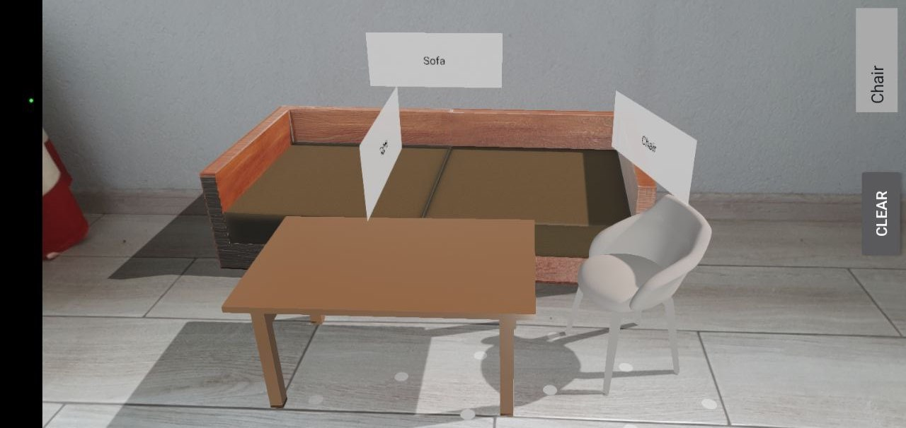

# ARCorePlayground

Simple prototype that gives an understanding of how Google's Sceneform works.
Sceneform(deprecated) helps to measure the space that the camera covers and provide a platform for placing so-called anchors.
In current project was developed 2 features:

### Features
- Ruler;
- Object placement;

### Ruler
Measures the distance between points, also if you put 4 points, they will unite and show the square of this figure.

| Example 1                                     | Example 2                                     |
|-----------------------------------------------|-----------------------------------------------|
|  |  |

### Object placement
Just arranges `.glb` item models. In the picture above you can see `sofa`, `chair`, `table` models placed on the floor.

